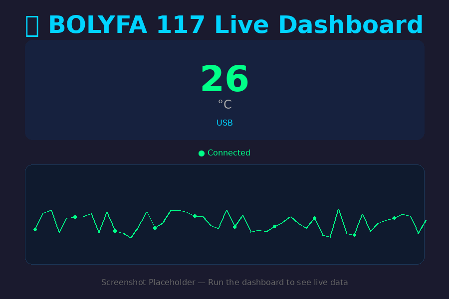

# BOLYFA 117 USB Digital Multimeter Data Logger

A Python 3 data logging application for the **BOLYFA 117** (and compatible) digital multimeters, reverse-engineered from the USB serial protocol.



## Features

- **Auto-detect** — Finds the CH340 COM port automatically on Windows, Linux, and macOS
- **Three modes** — Live console, CSV logger, and web dashboard
- **Auto-reconnect** — Survives USB disconnects and resumes logging automatically
- **Data smoothing** — Configurable rolling average to reduce jitter
- **Threshold alerts** — Beep and banner when value exceeds min/max limits
- **Mobile-friendly dashboard** — Responsive HTML5 canvas chart, works on phones and tablets
- **Cloud export** — Optional InfluxDB and MQTT integration for Home Assistant / Grafana
- **Zero external dependencies** for the dashboard (pure Python standard library)

## Quick Start

### Requirements

```bash
pip install pyserial
```

Optional (for MQTT export):
```bash
pip install paho-mqtt
```

### Windows 11

1. Plug in the multimeter USB cable
2. **Press the REL/USB button** on the meter until the USB icon appears
3. Check Device Manager → Ports (COM & LPT) to confirm the port
4. Run the dashboard:

```powershell
python bolyfa117_logger.py --mode dashboard
```

5. Open `http://127.0.0.1:8080` in your browser

### Linux / macOS

```bash
python3 bolyfa117_logger.py --mode dashboard --port /dev/ttyUSB0
```

## Usage

### Auto-detect (recommended)
```bash
python bolyfa117_logger.py --mode dashboard
```

### Live console
```bash
python bolyfa117_logger.py --mode live --port COM5
```

### CSV logger
```bash
python bolyfa117_logger.py --mode csv --port COM5
```

### With alerts
```bash
python bolyfa117_logger.py --mode dashboard --alert-max 30.0 --alert-beep
```

### With smoothing (5-sample rolling average)
```bash
python bolyfa117_logger.py --mode live --smoothing 5
```

### MQTT export (Home Assistant)
```bash
python bolyfa117_logger.py --mode dashboard --mqtt-broker 192.168.1.50 --mqtt-topic home/lab/dmm
```

### InfluxDB export (Grafana)
```bash
python bolyfa117_logger.py --mode dashboard --influxdb-url http://localhost:8086 --influxdb-token YOUR_TOKEN
```

## Configuration File

Copy `bolyfa117.json` and edit to your preferences:

```json
{
  "port": null,
  "mode": "dashboard",
  "baudrate": 2400,
  "output_dir": ".",
  "web_port": 8080,
  "smoothing_window": 5,
  "alert_min": null,
  "alert_max": 30.0,
  "alert_beep": true,
  "auto_reconnect": true,
  "reconnect_delay": 3,
  "influxdb_url": null,
  "influxdb_token": null,
  "influxdb_bucket": "dmm",
  "influxdb_org": "-",
  "mqtt_broker": null,
  "mqtt_port": 1883,
  "mqtt_topic": "bolyfa117/data",
  "mqtt_user": null,
  "mqtt_pass": null
}
```

Then run:
```bash
python bolyfa117_logger.py --config bolyfa117.json
```

## Protocol

The BOLYFA 117 streams a fixed **22-byte packet** over a **CH340 USB-to-serial bridge** at **2400 baud, 8N1**.

| Byte | Content |
|------|---------|
| 0–5 | Header: `0xAA 0x55 0x52 0x24 0x01 0x10` |
| 6–9 | Four 7-segment digits + decimal points |
| 10 | Sign, AC/DC, DIODE, CONT flags |
| 11–18 | Bar graph segments |
| 19 | MAX, MIN, %, hFE, USB flags |
| 20–21 | Units (Ω, V, A, Hz, °C, °F, F, %, prefixes) |

See [Protocol Analysis](BOLYFA117_Protocol_Analysis.md) for full details.

## Files

| File | Description |
|------|-------------|
| `bolyfa117_logger.py` | Main application (live / CSV / dashboard / export) |
| `bolyfa117_debug.py` | Diagnostic tool — raw hex dump |
| `bolyfa117.json` | Configuration template |
| `run_bolyfa117.bat` | Windows double-click launcher |
| `run_bolyfa117.ps1` | PowerShell launcher |
| `BOLYFA117_Protocol_Analysis.md` | Full protocol documentation |

## Troubleshooting

**No data appears?**
- Press the **REL/USB** button on the meter until the USB icon shows
- Run `python bolyfa117_debug.py COM5` to inspect raw bytes
- Check Device Manager for the correct COM port

**"Could not open port"?**
- The port may have changed after unplugging. Use `--list` to find it again.

**Garbled data?**
- Ensure the meter is in USB mode (USB icon on LCD)
- Try a different USB cable or port

## Credits

- Protocol reverse-engineered by [PaulZC](https://github.com/PaulZC/DMM_Data_Logger) and [Paul Daniels](https://github.com/inflex/BSIDE-ADM20)
- BOLYFA 117 meter by BOLYFA

## License

MIT License — see [LICENSE](LICENSE)
